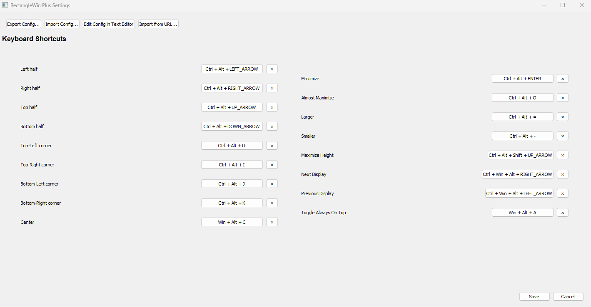

# RectangleWin Plus

**RectangleWin Plus** is a powerful window management utility for Windows, inspired by macOS's [Rectangle.app](https://rectangleapp.com) and [Spectacle.app](https://www.spectacleapp.com). It allows you to quickly snap windows to edges and corners, cycle through different sizes, and manage your workspace efficiently using customizable hotkeys.


## Features

-   **Window Snapping**: Snap windows to left/right/top/bottom halves, or to any of the four corners.
-   **Size Cycling**: Repeatedly pressing the snap hotkey cycles the window size between 1/2, 2/3, and 1/3 of the screen.
-   **Keyboard Centric**: Control everything with hotkeys. No mouse required.
-   **Settings UI**: Easily view and configure hotkeys through a user-friendly interface.
-   **URL Import**: Share and import hotkey configurations via URLs (e.g., Gist).
-   **System Tray**: Quick access to features and settings from the system tray.
-   **Multi-Monitor Support**: Move windows between displays with ease.

## Installation

1.  Go to the [Releases](https://github.com/phoeagon/RectangleWinPlus/releases) page.
2.  Download the latest binary (typically `RectangleWinPlus.exe`) for your architecture.
3.  Run the executable. The application will start and minimize to the system tray.
4.  (Optional) Right-click the tray icon and select "Run on startup" to have it launch automatically.

## Usage

### Default Hotkeys

RectangleWin Plus comes with a set of intuitive default hotkeys. You can customize these at any time via the Settings UI.

| Action | Hotkey | Description |
| :--- | :--- | :--- |
| **Snap Left** | `Ctrl` + `Alt` + `←` | Snap to left half. Press again to cycle (2/3, 1/3). |
| **Snap Right** | `Ctrl` + `Alt` + `→` | Snap to right half. Press again to cycle (2/3, 1/3). |
| **Snap Top** | `Ctrl` + `Alt` + `↑` | Snap to top half. Press again to cycle (2/3, 1/3). |
| **Snap Bottom** | `Ctrl` + `Alt` + `↓` | Snap to bottom half. Press again to cycle (2/3, 1/3). |
| **Top-Left** | `Win` + `Ctrl` + `U` | Snap to top-left corner. |
| **Top-Right** | `Win` + `Ctrl` + `I` | Snap to top-right corner. |
| **Bottom-Left** | `Win` + `Ctrl` + `J` | Snap to bottom-left corner. |
| **Bottom-Right** | `Win` + `Ctrl` + `K` | Snap to bottom-right corner. |
| **Maximize** | `Ctrl` + `Alt` + `Enter` | Maximize the window. |
| **Center** | `Win` + `Alt` + `C` | Center the window on screen. |
| **Next Display** | `Ctrl` + `Win` + `Alt` + `→` | Move window to next display. |
| **Prev Display** | `Ctrl` + `Win` + `Alt` + `←` | Move window to previous display. |

### Settings UI

To configure hotkeys:
1.  Right-click the system tray icon.
2.  Select **Settings**.
3.  In the Settings window, you can view current bindings.
4.  Click on a binding to record a new hotkey.



### URL Import

You can import configurations from a URL (e.g., a raw GitHub Gist).
1.  Open Settings.
2.  Click **Import from URL**.
3.  Paste the URL containing your `config.yaml` content.

## Advanced Configuration

Power users can manually edit the configuration file located at `%HOME%/.config/RectangleWin/config.yaml`.

The file uses a simple YAML structure:

```yaml
keybindings:
  - modifier:
      - Ctrl
      - Alt
    key: UP_ARROW
    bindfeature: moveToTop
```

See `conf.go` in the source code for a full list of valid keys and features.

## Command Line Arguments

RectangleWin Plus supports several command-line flags:

-   `--debug`: Enable debug mode (attaches console output).
-   `--killall`: Kill all running instances of the application.
-   `--version`: Show version information.
-   `--helpfull`: Show detailed help message with all available actions.
-   `--action=<action>`: Perform a specific action immediately (e.g., `--action=moveToLeft`).

## Development

To build from source (requires Go 1.17+):

```sh
git clone https://github.com/phoeagon/RectangleWinPlus.git
cd RectangleWinPlus
go generate
GOOS=windows go build -ldflags -H=windowsgui .
```

## Origin & Credits

This project is a fork of [phoeagon/RectangleWin](http://github.com/phoeagon/RectangleWin), which is a fork of [ahmetb/RectangleWin](http://github.com/ahmetb/RectangleWin). It introduces breaking changes and new features like the Settings UI and URL Import.

## License

Distributed under the Apache 2.0 License. See [LICENSE](./LICENSE) for details.
